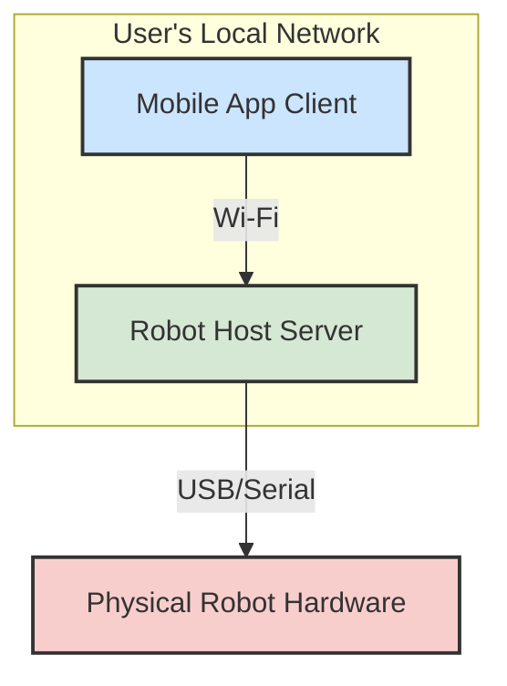
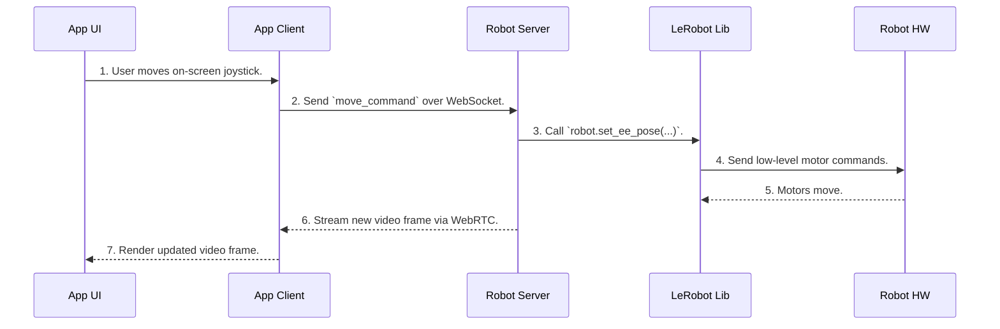

### **Solution Architecture & Design: LeRobot Studio (Sprint 1)**

**Version:** 1.0
**Status:** Draft
**Author:** Solution Architect

---

#### **1. Guiding Principles**

*   **Modularity:** The app (client) and the robot control logic (server) must be decoupled to allow for independent development and future scalability.
*   **Real-Time Performance:** The communication protocol must prioritize low latency for both robot control commands and video streaming to ensure a responsive user experience.
*   **Standard Technologies:** We will use well-supported, open-source technologies to accelerate development and ensure long-term maintainability.

---

#### **2. High-Level Architecture**

The system is composed of three main components: the **Mobile App (Client)**, the **Robot Host (Server)**, and the **Physical Robot Hardware**. The Robot Host acts as the brain, running the server and the core LeRobot library, while the Mobile App serves as the user interface.

---

#### **3. Component Breakdown**

**3.1. Mobile App (Client)**
*   **Responsibilities:**
    *   Render the user interface.
    *   Discover the Robot Host on the network.
    *   Establish and maintain a persistent connection.
    *   Capture user input (joystick movements, button presses).
    *   Send control commands to the server.
    *   Receive and display the live video stream.

**3.2. Robot Host (Server)**
*   **Responsibilities:**
    *   Broadcast its presence on the network for discovery.
    *   Listen for and manage incoming client connections.
    *   Receive and interpret control commands.
    *   Translate commands into low-level hardware instructions using the LeRobot library.
    *   Capture the video feed from the robot's camera.
    *   Stream the video feed to the client.

---

#### **4. Technology Stack Recommendation**

| Component | Technology | Rationale |
| :--- | :--- | :--- |
| **Mobile App Framework** | **React Native** | Cross-platform (iOS/Android) with a large community and strong support for networking libraries. |
| **Robot Host Server** | **Python with FastAPI** | Python is the native language of LeRobot. FastAPI is a modern, high-performance web framework with excellent support for WebSockets and asynchronous operations. |
| **Network Discovery** | **mDNS (Zeroconf)** | Standard protocol for zero-configuration network discovery. Allows the app to find the robot without the user entering an IP address. |
| **Control & Data Channel** | **WebSockets** | Provides a persistent, low-latency, bidirectional communication channel perfect for sending a stream of control commands. |
| **Video Streaming** | **WebRTC** | The gold standard for real-time, peer-to-peer video streaming. It is designed for ultra-low latency, which is critical for teleoperation. |

---

#### **5. Data Flow & Sequence Diagram**

This diagram illustrates the end-to-end flow for the most critical real-time interaction: moving the robot arm.

**Interaction: User Moves Joystick**

---

#### **6. Future Considerations**

This client-server architecture provides a solid foundation for future development:
*   **Scalability:** The Robot Host server can be run on more powerful hardware (e.g., a desktop PC with a GPU) to handle future AI model inference without changing the mobile app.
*   **Flexibility:** The use of standard protocols (WebSockets, WebRTC) means that other clients (e.g., a web browser interface) could be developed to interact with the same Robot Host server.
*   **Decoupling:** The separation of concerns allows the UI/UX team to iterate on the app independently of the core robotics logic running on the server.

This design provides a clear and robust blueprint for the engineering team to begin building the core of the LeRobot Studio application.
